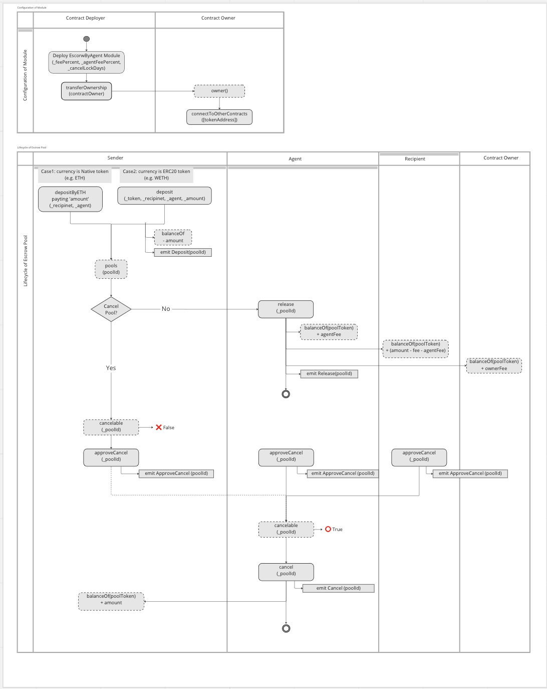

## How To Use
1. Deploy this contract. (Anybody can deploy this contract for an escrow service and make money from this service)
2. Create an escrow pool with Recipient, Agent and amount
    - call `depositByETH` to deposit ETH
    - call `deposit` to deposit any ERC20 token
        * can't use same address for Recipient and Agent. 
3. Once you (Sender) allow the Agent to release the payment 
      (this option is outside of blockchain), the Agent will release the payment.
    - call `release()` by Agent
        * `ownerFee` will be transferred to smart contract owner
        * `AgentFee` will be transferred to the Agent
4. Approve to cancel the payment when you want to cancel it.
    - call `approveCancel()`
        * Sender, Recipient and Agent will approve for canceling
5. Cancel the payment
    - call `cancel()` to cancel the payment.
  This function works under following cases:
      - 1. Both of Recipient and Sender called `acceptCancel()`.

      - 2. Both of Sender and Agent called `acceptCancel()`.

## Operation
### Business Process Diagrams
